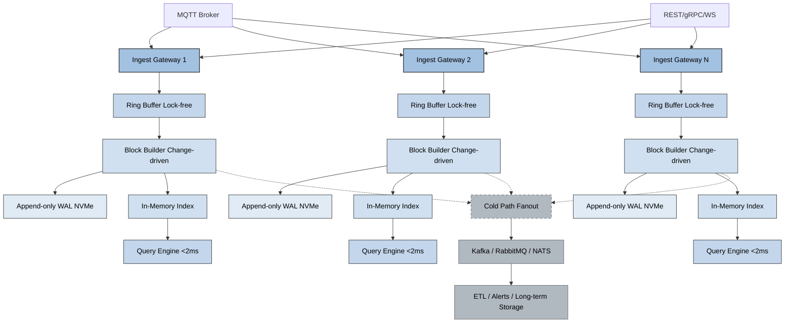

# SignalBlocks

**Deterministic ultra-low latency analytics for industrial time-series data**

SignalBlocks is a real-time analytics accelerator that sits on top of existing time-series databases (ClickHouse, InfluxDB, etc.) to deliver predictable **<2ms** query latency for repetitive industrial dashboards — no more non-deterministic GROUP BY or raw data scans.

Built for manufacturing, energy, utilities, and Industry 4.0/5.0 environments handling high-frequency sensor/PLC/OPC/MQTT data.

## ✨ Core Features (MVP in progress)

- **Change-driven immutable blocks** — blocks created only on meaningful data changes (delta/threshold-based), not fixed intervals
- **In-memory aggregation index** — deterministic latency for common KPIs (time-weighted avg, duration per state, min/max, integrals)
- **Metadata-driven tag model** — per-tag aggregation rules, grouping, and change policies
- **No runtime GROUP BY** — pre-aggregated blocks eliminate expensive queries on large time ranges
- **Hot/Warm/Cold storage paths** — RAM → NVMe (light compression) → S3/MinIO (aggressive compression)
- Integrates with Grafana, Power BI, custom UIs

## Why SignalBlocks?

Existing time-series DBs (ClickHouse, Influx, Timescale) excel at ingestion & throughput, but struggle with **predictable low-latency** for repetitive dashboard workloads in industrial settings.

SignalBlocks acts as an **accelerator layer** — keep your raw data for audits/deep analysis, but serve 99% of operational dashboards from fast, immutable aggregated blocks.

## Proposed Architecture (Recommended for Real-time & Low-Latency)

To achieve **sub-2ms deterministic latency** for dashboards while handling high-frequency industrial data ingestion, the following dual-path architecture is recommended:

- **WebSocket / Streaming** for continuous, low-latency ingest & live push to dashboards
- **REST / gRPC API** for on-demand queries, configuration, and integration with tools

Key Benefits of this Architecture:

WebSocket/MQTT → minimal latency for continuous high-frequency ingestion from industrial devices
In-memory index → serves both live updates (push) and fast queries
Dual output → live real-time dashboards via WebSocket + flexible on-demand access via REST/gRPC
Scalable & efficient — Go's concurrency model (goroutines) handles thousands of connections with low overhead

Implementation Notes (Go):

Use github.com/gorilla/websocket for WebSocket endpoints
Use github.com/gin-gonic/gin or net/http for REST
Optional: github.com/grpc/grpc-go for gRPC if type-safety & streaming is needed
Global broadcaster (channel) to push new aggregations to all connected dashboard clients

This architecture ensures SignalBlocks remains ultra-low latency while being flexible for different use cases.

Main data flow:

Raw data is ingested and stored in Raw Storage for audit and deep analysis
Change-driven blocks are created only on meaningful changes (not fixed time intervals)
Immutable aggregated blocks feed the in-memory index
Query planner serves sub-2ms responses directly from the index to dashboards

Current Status

MVP in progress (built with Go)
Ingestion API (OPC/MQTT simulation)
Change-driven Block Builder
In-memory Aggregation Index (Redis-like)
Basic query planner & Grafana integration demo

Pre-seed stage — actively developed by founder with years of hands-on industrial BI/time-series experience
Targeting first pilot use cases in 2026

Quick Start (once MVP ready)
Bash# Coming soon — example when prototype is runnable
git clone https://github.com/masoudrajaei/signalblocks.git
cd signalblocks
go run cmd/signalblocks/main.go --config=config.yaml

(Currently the repo is at skeleton stage — follow updates!)
Roadmap (2026)

Q1: MVP prototype + sample industrial dataset demo
Q2: Pilot validation with real use cases
Q3: Open API + Grafana datasource plugin
Q4: Early community contributions + benchmarks vs. raw DB queries

Contributing
Contributions welcome! This is early stage — issues, PRs, ideas for industrial use cases are all appreciated.
See CONTRIBUTING.md (coming soon).
License
MIT License — see LICENSE

Contact / Founder
Masoud Rajaei
Founder @ MetaBlock Systems
mr.rajjaei@gmail.com
+989135605562
Open to collaboration, pilots, accelerators in world
Built with ❤️ for smarter industrial decisions.

