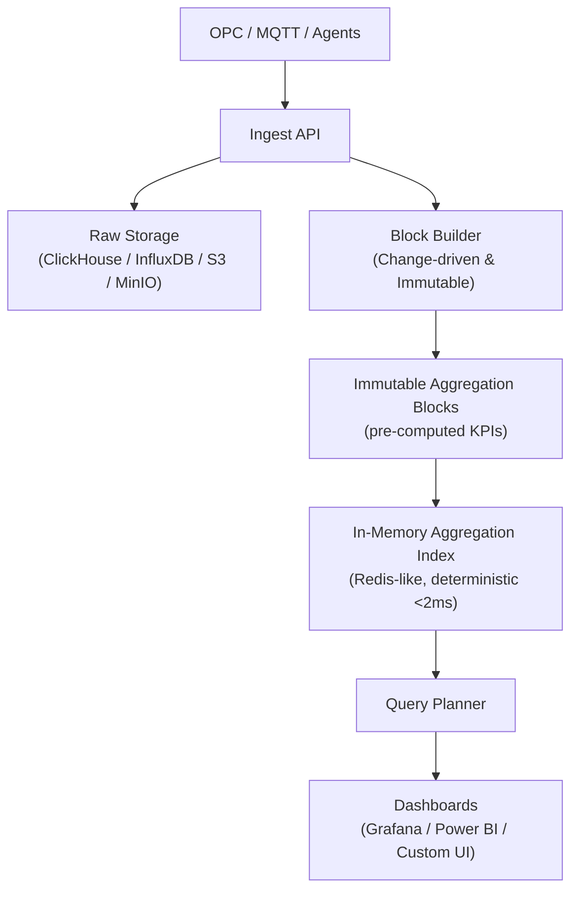
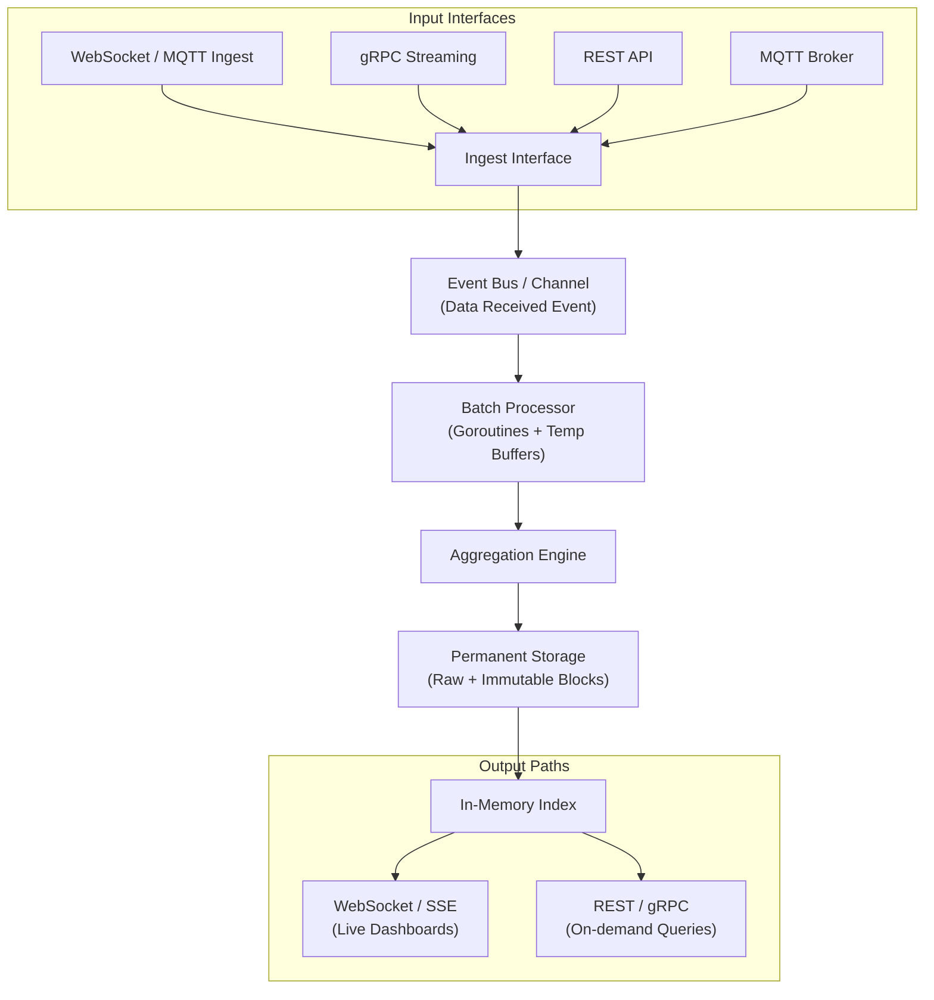

# SignalBlocks - خلاصه کامل گفتگو با Grok (تا ۷ فوریه ۲۰۲۶)

## هدف پروژه (از اول)
- SignalBlocks یک accelerator analytics real-time برای داده‌های صنعتی time-series
- هدف اصلی: latency <2ms برای داشبوردهای تکراری (بدون GROUP BY در زمان اجرا)
- روی دیتابیس‌های موجود (ClickHouse, InfluxDB و غیره) سوار می‌شود
- ویژگی کلیدی: change-driven immutable blocks + in-memory aggregation index
- کاربرد: manufacturing, energy, utilities, Industry 4.0/5.0

## معماری سطح بالا (High-Level Architecture)


جریان اصلی:
- Raw data برای audit ذخیره می‌شود
- بلوک‌ها فقط هنگام تغییرات معنادار ساخته می‌شوند
- شاخص in-memory پاسخ‌دهی سریع می‌دهد

## معماری پیشنهادی پیشرفته (با ورودی/خروجی دوگانه)

Key principles:
- Change-driven immutable blocks
- In-memory index for fast lookups
- Dual input/output paths (live push + on-demand query)
- Event-driven metadata aggregation (e.g., Heat Sessions)
- Hive-style partitioned Parquet files for BI efficiency
- Redis for hot path caching
- DuckDB as query layer for Power BI / Grafana

```mermaid
graph TD
    subgraph "Input Sources"
        DEV[Industrial Devices<br>Sensors / PLC / OPC / MQTT] --> ING["Ingest Interfaces<br>(WebSocket + gRPC + REST + MQTT)"]
    end

    ING -->|Normalize / Validate / Rate Limit| EB["Event Bus<br>(Go Channels / NATS / Redis Pub/Sub)"]

    EB -->|Concurrent Workers| PROC["Processing Layer<br>(Batch + Aggregation Engine)"]

    PROC -->|Write State & Changes| SV["State Vectors<br>(Parquet - segment_start / end + vector)"]
    PROC -->|Write Numeric Changes| VD["Value Data<br>(Parquet - timestamp + value + quality)"]

    PROC -->|Trigger on Key Changes| SB["Session Builder Service<br>(Event-Driven: Heat / Shift / Campaign)"]
    SB --> HS["Heat_Sessions.parquet<br>(per-heat KPIs: energy, uptime, faults, ...)"]

    subgraph "Storage & Hot Path"
        SV & VD & HS --> PS["Permanent Storage<br>(Hive-style Parquet: year/month/day/group)"]
        PS --> REDIS["Redis<br>(In-Memory Index + Live Cache + Pub/Sub)"]
    end

    subgraph "Query & BI Layer"
        REDIS -->|Live / Cached| DASH["Live Dashboards<br>(Grafana + WebSocket push)"]
        PS --> DUCK["DuckDB<br>(Query Engine + Joins + Materialized Views)"]
        DUCK --> BI["Power BI / Tableau<br>(Dimension: Heat_Sessions<br>Fact: State + Value)"]
    end

    %% Styling for clarity
    style ING fill:#ff9,stroke:#333,stroke-width:2px
    style PROC fill:#bbf,stroke:#333
    style SB fill:#9f9,stroke:#333
    style REDIS fill:#ffcc00,stroke:#333
    style DUCK fill:#ccffcc,stroke:#333
    style PS fill:#f0f0f0,stroke:#999
    
    ```

ndustrial Devices
        ↓
   Ingest Interfaces (WebSocket + gRPC + REST)
        ↓
   Event Bus
        ↓
   Processing Layer → State Vector + Value Data (Parquet)
        ↓
   Redis (In-Memory Index + Live Cache)
        ↓
   Session Builder Service (Event-Driven) → Heat_Sessions.parquet
        ↓
   DuckDB (Query Layer)
        ↓
   Power BI  ←→  Grafana
   
## تقسیم به لایه‌ها
- Ingest Layer: دریافت، normalize، ارسال به event bus (سبک)
- Write/Processing Layer: aggregation، تخلیه به storage + WAL
- Index/Query Layer: نگهداری index، پاسخ سریع

## WAL (Write-Ahead Logging)
- قبل از write اصلی، تغییر را به log append-only بنویس
- برای recovery در crash (replay log)
- asynchronous WAL برای حفظ latency پایین
- حجم: ~۵۰۰KB/sec در ۱۰k point/sec

## دو فایل Parquet مجزا برای هر گروه تگ
1. state_vectors.parquet
   - segment_start (int64)
   - segment_end (int64)
   - vector (binary, ۲ بیت per tag)
   - change_count (int32)

2. value_data.parquet
   - segment_start (int64)
   - tag_index (int16)
   - timestamp (int64)  ← فقط نقاط تغییر
   - value (double)
   - quality (int8)

Partitioning: year/month/day

## فایل سوم: Heat_Sessions.parquet (برای تحلیل per-heat)
- heat_number
- start_time
- end_time
- duration_ms
- total_energy_kwh
- avg_power_kw
- uptime_seconds
- fault_count
- ...

این فایل سبک است (روزانه چند ده ردیف) و برای Power BI به عنوان Dimension Table عالی کار می‌کند.

## متادیتا (metadata.yaml)
- group_by_enabled: true/false
- triggers_session: true/false
- session_type: heat/shift/...
- session_kpi: [total_energy_kwh, uptime_seconds, ...]

## ایده Session Builder Service
- Event-Driven (نه polling)
- وقتی Heat Number تغییر کرد → event → محاسبه KPIها → نوشتن در Heat_Sessions.parquet
- overhead کم، تأخیر کم، منابع کم

## پیشنهادهای کلی
- اولویت ورودی: WebSocket/gRPC برای real-time، REST برای legacy
- WAL + replication (حداقل ۳ کپی) برای جلوگیری از data loss
- compression ZSTD + checksum
- backpressure و rate limiting روی ingest
- پارتیشن‌بندی روی فایل‌ها (year/month/day)
- drill-down در Power BI با join روی segment_start/end یا heat_number

این خلاصه همه بحث‌های مفید و نتیجه‌گیری‌های نهایی ماست.

هر وقت برگشتی، می‌تونیم schema دقیق گروه‌ها (مثل EAF Electrical) رو بنویسیم یا روی Session Builder بیشتر کار کنیم.